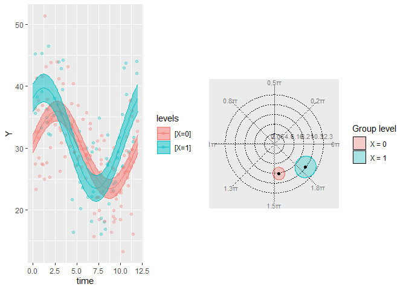

<!-- README.md is generated from README.Rmd. Please edit that file -->

# GLMMcosinor

<!-- badges: start -->

[](https://github.com/RWParsons/GLMMcosinor/actions/workflows/R-CMD-check.yaml)
[](https://app.codecov.io/gh/RWParsons/GLMMcosinor?branch=main)
[](https://www.gnu.org/licenses/gpl-3.0)
[](https://github.com/RWParsons/GLMMcosinor/actions?query=workflow%3Apkgcheck)
<!-- badges: end -->


The goal of GLMMcosinor is to fit a generalised linear (mixed-) model
(GLM) to circadian data that may be sourced but passing on the
flexibility of the glmmTMB framework. For example, this includes the
ability to use link functions appropriate for outcome variables that are
gaussian, poisson, gamma, or binomial.

Existing statistical software for circadian data analyses (including
`cosinor` or `circacompare`) allow the user to fit such data to a linear
model, but many are limited in due to this; GLMMcosinor aims to be
comprehensive and flexible. Hence, GLMMcosinor is an improvement of
other implementations of similar algorithms in R. See table below for
features available within different currently available software.

#### TODO add table

## Installation

You can install the development version of GLMMcosinor from
[GitHub](https://github.com/) with:

``` r
# install.packages("remotes")
remotes::install_github("RWParsons/GLMMcosinor")
```

## Example

This is a basic example which shows you how to solve a common problem:

``` r
library(GLMMcosinor)
```

``` r
data(vitamind)
model <- cosinor.glmm(Y ~ X + amp.acro(time, group = "X"), data = vitamind)
summary(model)
#> 
#>  Conditional Model 
#> Raw model coefficients:
#>                estimate standard.error   lower.CI  upper.CI   p.value
#> (Intercept)  29.6897959      0.4583696 28.7914079 30.588184 0.0000000
#> X1            1.9018623      0.7919688  0.3496320  3.454093 0.0163309
#> X0:main_rrr1  0.9307876      0.6260656 -0.2962784  2.157853 0.1370874
#> X1:main_rrr1  6.5102900      0.9303406  4.6868560  8.333724 0.0000000
#> X0:main_sss1  6.2009896      0.6701952  4.8874311  7.514548 0.0000000
#> X1:main_sss1  4.8184618      0.8963299  3.0616875  6.575236 0.0000001
#> 
#> Transformed coefficients:
#>               estimate standard.error   lower.CI   upper.CI   p.value
#> (Intercept) 29.6897959      0.4583696 28.7914079 30.5881839 0.0000000
#> [X=1]        1.9018623      0.7919688  0.3496320  3.4540926 0.0163309
#> [X=0]:amp1   6.2704576      0.6696564  4.9579551  7.5829600 0.0000000
#> [X=1]:amp1   8.0994722      1.1028357  5.9379540 10.2609904 0.0000000
#> [X=0]:acr1  -1.4218056      0.0999356 -1.6176757 -1.2259354 0.0000000
#> [X=1]:acr1  -0.6371544      0.1404362 -0.9124044 -0.3619044 0.0000057
```

``` r
plot(model, superimpose.data = TRUE)
polar_plot(model)
```

``` r
p1 <- plot(model, superimpose.data = TRUE)
p2 <- polar_plot(model)
cowplot::plot_grid(p1, p2, nrow=1)
```



## Citation

``` r
citation("GLMMcosinor")
#> Warning in citation("GLMMcosinor"): no date field in DESCRIPTION file of package
#> 'GLMMcosinor'
#> 
#> To cite package 'GLMMcosinor' in publications use:
#> 
#>   Parsons R, Jayasinghe O (2023). _GLMMcosinor: Fit a cosinor model
#>   using a generalised mixed modelling framework_.
#>   https://github.com/RWParsons/GLMMcosinor,
#>   https://rwparsons.github.io/GLMMcosinor/.
#> 
#> A BibTeX entry for LaTeX users is
#> 
#>   @Manual{,
#>     title = {GLMMcosinor: Fit a cosinor model using a generalised mixed modelling
#> framework},
#>     author = {Rex Parsons and Oliver Jayasinghe},
#>     year = {2023},
#>     note = {https://github.com/RWParsons/GLMMcosinor,
#> https://rwparsons.github.io/GLMMcosinor/},
#>   }
```
