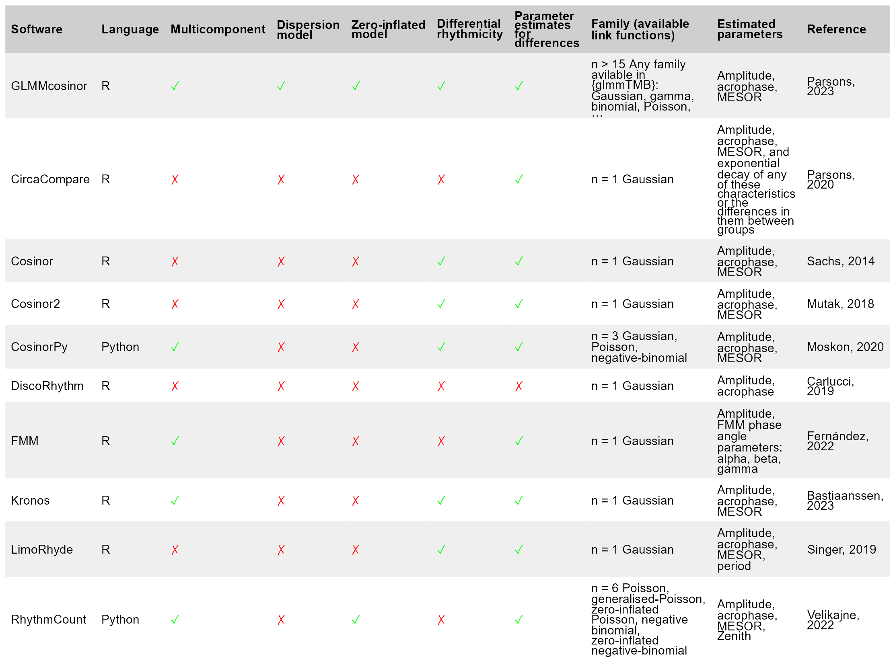

<!-- README.md is generated from README.Rmd. Please edit that file -->

# GLMMcosinor

<!-- badges: start -->

[](https://github.com/RWParsons/GLMMcosinor/actions/workflows/R-CMD-check.yaml)
[](https://app.codecov.io/gh/RWParsons/GLMMcosinor?branch=main)
[](https://www.gnu.org/licenses/gpl-3.0)
<!-- badges: end -->

The goal of `{GLMMcosinor}` is to fit a cosinor model to rhythmic data
but allow the functionality of a generalised linear (mixed-) model (GLM)
framework using `{glmmTMB}`. For example, this includes the ability to
use link functions appropriate for outcome variables that are Gaussian,
Poisson, Gamma, or Binomial.

Existing statistical software for circadian data analyses (including
`cosinor` or `circacompare`) allow the user to fit such data using a
regression model, but many are limited due to the lack being able to
specify a link function, multiple components, or a hierarchical
structure. `GLMMcosinor` aims to be comprehensive and flexible and is an
improvement on other implementations of the cosinor model in R or
Python. See table below for features available within currently
available methods.



## Installation

You can install the development version of GLMMcosinor from
[GitHub](https://github.com/) with:

``` r
# install.packages("remotes")
remotes::install_github("RWParsons/GLMMcosinor")
```

## Example

This is a basic example which shows you how to solve a common problem:

``` r
library(GLMMcosinor)
```

``` r
data(vitamind)
model <- cosinor.glmm(Y ~ X + amp_acro(time, group = "X", period = 12), data = vitamind)
summary(model)
#> 
#>  Conditional Model 
#> Raw model coefficients:
#>                estimate standard.error   lower.CI upper.CI    p.value    
#> (Intercept)  29.6897959      0.4583696 28.7914079 30.58818 < 2.22e-16 ***
#> X1            1.9018623      0.7919688  0.3496320  3.45409   0.016331 *  
#> X0:main_rrr1  0.9307876      0.6260656 -0.2962784  2.15785   0.137087    
#> X1:main_rrr1  6.5102900      0.9303406  4.6868560  8.33372 2.6011e-12 ***
#> X0:main_sss1  6.2009896      0.6701952  4.8874311  7.51455 < 2.22e-16 ***
#> X1:main_sss1  4.8184618      0.8963299  3.0616875  6.57524 7.6257e-08 ***
#> ---
#> Signif. codes:  0 '***' 0.001 '**' 0.01 '*' 0.05 '.' 0.1 ' ' 1
#> 
#> Transformed coefficients:
#>               estimate standard.error   lower.CI upper.CI    p.value    
#> (Intercept) 29.6897959      0.4583696 28.7914079 30.58818 < 2.22e-16 ***
#> [X=1]        1.9018623      0.7919688  0.3496320  3.45409   0.016331 *  
#> [X=0]:amp1   6.2704576      0.6696564  4.9579551  7.58296 < 2.22e-16 ***
#> [X=1]:amp1   8.0994722      1.1028357  5.9379540 10.26099 2.0696e-13 ***
#> [X=0]:acr1   1.4218056      0.1000725  1.2256670  1.61794 < 2.22e-16 ***
#> [X=1]:acr1   0.6371544      0.1360809  0.3704408  0.90387 2.8385e-06 ***
#> ---
#> Signif. codes:  0 '***' 0.001 '**' 0.01 '*' 0.05 '.' 0.1 ' ' 1
```

``` r
autoplot(model, superimpose.data = TRUE)
polar_plot(model)
```


## Citation

``` r
citation("GLMMcosinor")
#> Warning in citation("GLMMcosinor"): no date field in DESCRIPTION file of
#> package 'GLMMcosinor'
#> 
#> To cite package 'GLMMcosinor' in publications use:
#> 
#>   Parsons R, Jayasinghe O (2023). _GLMMcosinor: Fit a cosinor model
#>   using a generalised mixed modelling framework_.
#>   https://github.com/RWParsons/GLMMcosinor,
#>   https://rwparsons.github.io/GLMMcosinor/.
#> 
#> A BibTeX entry for LaTeX users is
#> 
#>   @Manual{,
#>     title = {GLMMcosinor: Fit a cosinor model using a generalised mixed modelling
#> framework},
#>     author = {Rex Parsons and Oliver Jayasinghe},
#>     year = {2023},
#>     note = {https://github.com/RWParsons/GLMMcosinor,
#> https://rwparsons.github.io/GLMMcosinor/},
#>   }
```
